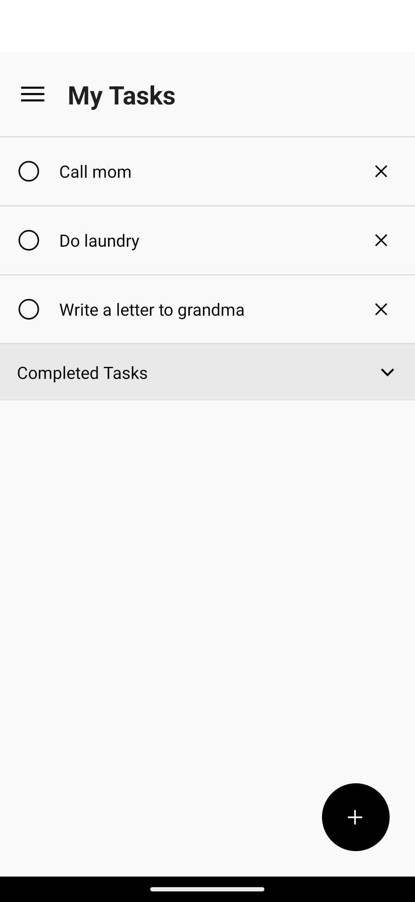
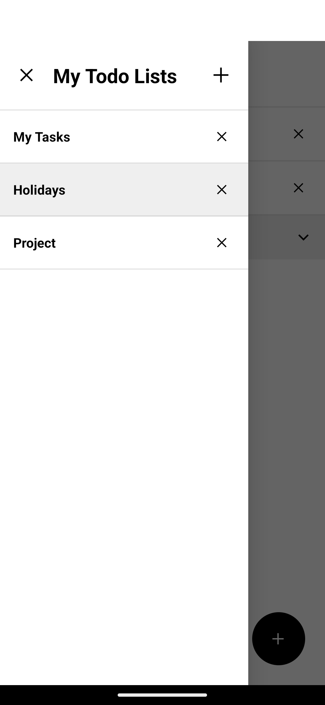

# Done

## Description

Done is a simple todo list app, made for Android with React Native.

Features:

- create and delete todo lists
- add, complete and delete tasks
- light and dark mode

## Screenshots

<p float="left" align="middle">


</p>

## Requirements

- Node.js v18.x or higher
- React Native CLI

## Installation

1. Clone the repository:

```bash
git clone https://github.com/nicodeck/Done.git
```

2. Install dependencies:

```bash
cd Done
yarn install
```

3. Build the app in debug mode:

```bash
yarn start
```
